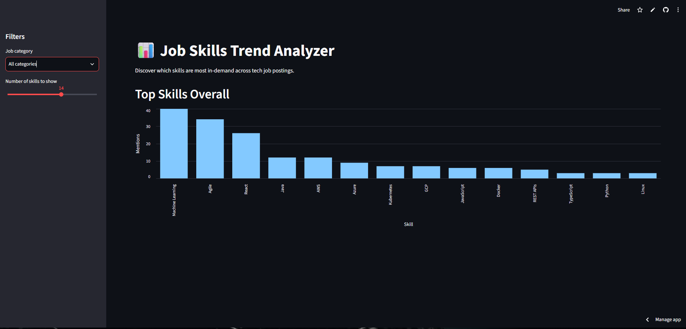

# Job Skills Trend Analyzer

A full-stack data pipeline and dashboard that scrapes live job postings, extracts in-demand technical skills using NLP, and visualizes trends across different tech roles — helping answer the question: *what should I actually be learning right now?*

**🔗 Live demo:** [https://job-skills-trend-analyzer-92na52wywsllwjj6mrklwd.streamlit.app/]

---

## What it does

This project collects real, live job postings across 8 tech roles (software engineer, data analyst, data scientist, backend/frontend developer, ML engineer, cloud security engineer, and cybersecurity engineer), extracts mentioned technical skills from each posting using keyword-based NLP, and presents the results in an interactive dashboard — broken down by role, with results ranked by frequency.

Unlike a one-off analysis, the pipeline runs **automatically every week** via GitHub Actions, building real historical trend data over time.

## Screenshot



## Tech stack

| Layer | Tools |
|---|---|
| Data collection | Python, [Adzuna API](https://developer.adzuna.com/) |
| Storage | SQLite, SQLAlchemy (ORM) |
| Skill extraction | Custom regex/keyword-based NLP |
| Backend API | FastAPI |
| Dashboard | Streamlit, Altair |
| Testing | Pytest |
| Automation | GitHub Actions (scheduled weekly runs) |
| Containerization | Docker |
| Deployment | Streamlit Community Cloud |

## Architecture

```
Adzuna API
    ↓
Collection script (pipeline/collect_jobs.py)
    ↓
SQLite database (job_postings table)
    ↓
Skill extraction (pipeline/extract_skills.py)
    ↓
SQLite database (extracted_skills table)
    ↓
Analysis layer (pipeline/analysis.py)
    ↓
   ┌─────────────┬─────────────────┐
   ↓                                ↓
FastAPI backend                Streamlit dashboard
(REST endpoints)                (interactive charts)
```

The entire collection → extraction → snapshot pipeline runs automatically every Monday via a scheduled GitHub Action, so the dataset keeps growing over time without manual intervention.

## Running it locally

**Requirements:** Python 3.11+, an [Adzuna API key](https://developer.adzuna.com/) (free)

```bash
# Clone the repo
git clone https://github.com/carrigerkevin-pixel/job-skills-trend-analyzer.git
cd job-skills-trend-analyzer

# Set up environment
python3 -m venv venv
source venv/bin/activate      # Mac/Linux
venv\Scripts\activate         # Windows

pip install -r requirements.txt

# Add your API credentials
# Create a .env file with:
# ADZUNA_APP_ID=your_id
# ADZUNA_APP_KEY=your_key

# Initialize the database and collect data
python pipeline/init_db.py
python pipeline/collect_jobs.py
python pipeline/run_extraction.py

# Run the dashboard
streamlit run dashboard/app.py

# Or run the API
uvicorn api.main:app --reload
```

### Running with Docker

```bash
docker build -t job-skills-analyzer .
docker run -p 8501:8501 job-skills-analyzer
```

Then visit `http://localhost:8501`.

## Running tests

```bash
pytest
```

Covers data deduplication logic and all API endpoints, including error handling for invalid input.

## Known limitations

- **Truncated descriptions:** Adzuna's free API tier truncates job descriptions to ~500 characters, which likely undercounts skills mentioned later in a posting (e.g. in "requirements" sections). Skill counts should be read as directional signals, not exhaustive coverage.
- **Database sync across environments:** The SQLite database is version-controlled and shared across local development, CI, and deployment. This works but isn't how a production system would be architected — see below.

## What I'd improve next

- Replace the local SQLite file with a hosted database (e.g. PostgreSQL) as a single source of truth, removing sync conflicts between local dev, CI, and deployment
- Expand skill matching beyond keyword lists using a proper NLP library (e.g. spaCy) to catch more phrasing variations
- Pull full job descriptions (not just truncated previews) by following each posting's original URL for a richer dataset
- Add real trend-over-time charts once enough weekly snapshots have accumulated

## Project background

Built as a self-directed learning project to practice full-stack data engineering: API integration, database design, NLP, REST API development, automated CI/CD pipelines, containerization, and deployment — most of it new territory, learned hands-on while building.
